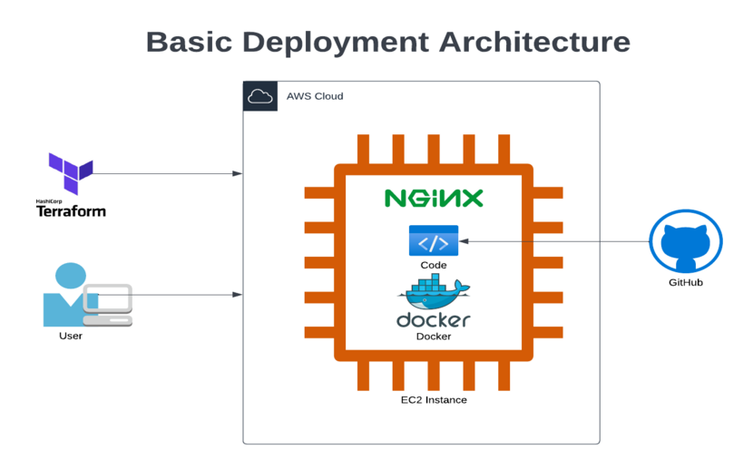

# Steps for deployment

### This deployment is carried out in AWS platform



#### The following steps will provision an ec2 instance with Ubuntu 20.04 and run a bash script on the instance after boot. The script will provision the instance for frontend and backend application deployment, deploy the application and output an elastic IP that can be used to access the app.  

1. Checkout the branch and change directory to terrform
```bash
$ cd terraform
```
2. Update your desired parameters in terraform.tfvars file.

3. Initiatize terrform. (Note: you should have terraform in your machine to run this. Refer [this link for installation.](https://developer.hashicorp.com/terraform/tutorials/aws-get-started/install-cli)) 
```bash
$ terraform init
```
4. Verify the resources targeted by terraform
```bash
$ terraform plan
```
5. If everything looks good, apply the changes
```bash
$ terraform apply -auto-approve
```
6. Terraform will output a public IP upon successful execution. 

### Wait for some time for the post-deployment script to complete. Access the public ip in browser.
http://ip-address 